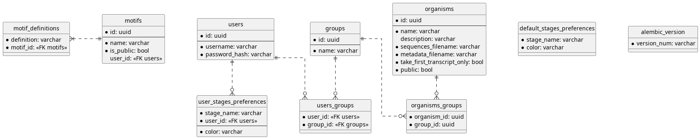

# Database

GOLEM uses SQLModel and PostgreSQl for the data storage. For more information about `SQLModel` usage refer to the [SQLModel](https://sqlmodel.tiangolo.com/) and [SQLAlchemy](https://www.sqlalchemy.org/) documentation.

The schema documentation in the `puml` format can be found  in [app/db/schema.puml](../../../../backend/app/db/schema.puml). 




## Table definition

The individual tables are defined in `app/db/models/`.

All entities define a method `__admin_repr__` which is used for displaying the label instead of the UUID in the admin interface.


## Migrations

Alembic is used to manage database migrations. The migration scripts are located in `app/db/migrations/`. To apply migrations, run (from the `app/db` directory):

```bash
$ uv run alembic upgrade head
```

To create a new migration script, run:
```bash
$ uv run alembic revision --autogenerate -m "migration description" 
```

*IMPORTANT!* When adding a new table, make sure to import it in the `app/db/migrations/env.py` file to ensure it is included in the migrations.


## Repositories

The repositories are located in `app/db/repositories/`. They provide an interface for interacting with the database. For example, the `UserRepository` provides methods for creating, reading, updating and deleting users.

Database engine is created and configured in `app/db/db.py`. The file also contains a function `get_session` which you can use to obtain a database session.

```python
class ExampleRepository:

    def __init__(self, session: AsyncSession = Depends(db.get_session)) -> None:
        self.session = session
```

## Seeds

To make local development easier, you can use the seeds script to populate the database with initial data. The seeds script is located in `app/db/seeds.py`. The seeds for individual entities are located in `app/db/seeds/`.
